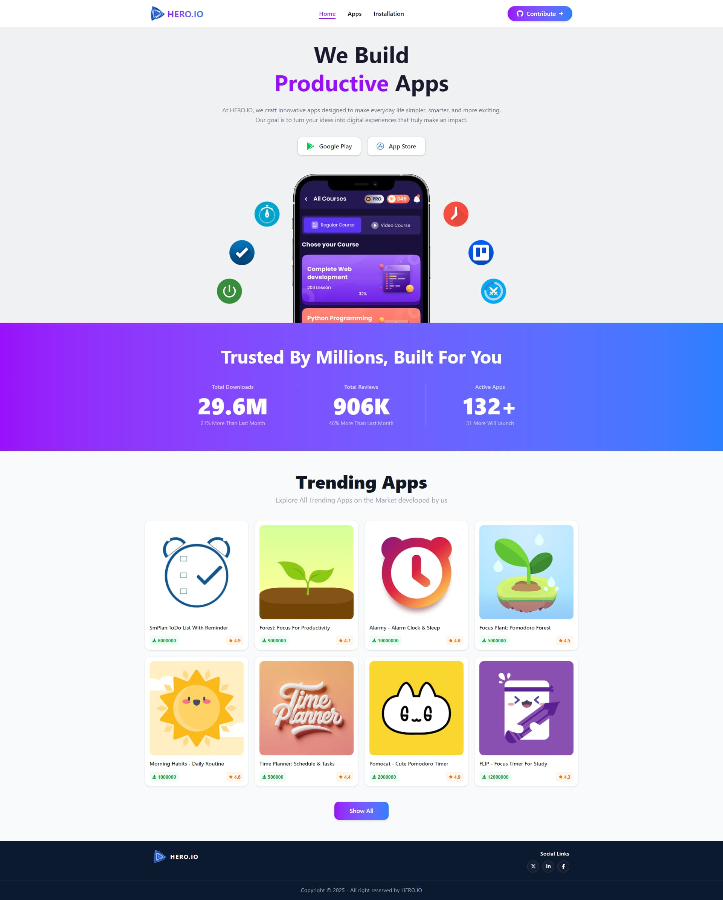

# Hero IO — The Ultimate App Discovery Platform
---

## 📖 Description

**Hero IO** is a modern, fully responsive app discovery and management platform — inspired by popular app stores. Users can explore a curated collection of apps, view detailed information, install/uninstall apps, search and sort by downloads, and track their installed apps — all within a beautifully designed interface.

Whether you're browsing on a phone, tablet, or desktop, **Hero IO** delivers a seamless and polished experience.

---

## 🌐 Live Demo

🔗 **[Visit Hero IO →](YOUR_LIVE_LINK_HERE)**

---

## ✨ Features

### 🏠 Home Page
- Eye-catching **banner** with App Store & Play Store redirect buttons
- **Stats section** showcasing platform highlights (total apps, downloads, users)
- **Top 8 Apps** displayed in a responsive 4-column grid
- Each app card shows title, image, download count & average rating
- **"Show All"** button navigates to the full app listing

### 📱 All Apps Page
- Displays **all apps** from the dataset
- **Live search** — filters apps by title in real-time (case-insensitive)
- **"No App Found"** message when search yields no results
- Total app count displayed dynamically
- **Sort by Downloads** dropdown (High → Low / Low → High)

### 📊 App Details Page
- Full app info: image, title, rating, reviews, downloads, company
- **Install button** — becomes disabled with "Installed" text after clicking
- **Success toast notification** on installation
- **Interactive bar chart** using [Recharts](https://recharts.org) to visualize star ratings
- Detailed app description section

### 💾 My Installation Page 
- Displays all **locally installed apps** using `localStorage`
- **Uninstall button** removes the app from UI and localStorage instantly
- Toast notification on uninstall

### 🔍 Search & Sort
- Real-time **live search**
- **Sort dropdown** for downloads (High-Low / Low-High)

### 🔧 Other Features
- **Custom 404 Error Page** for invalid routes
- **Loading animation** during page navigation and search
- **Relevant "Not Found"** message on App Details if app ID is invalid
- **Reload-safe routing** — no 404 on refresh after deployment

---
## 📸 Screenshots

### 🏠 Home Page


---
## 🛠️ Technologies Used

| Technology | Purpose |
|---|---|
| **React 18** | Frontend UI Library |
| **React Router DOM** | Client-side Routing |
| **Tailwind CSS** | Utility-first Styling |
| **Recharts** | Responsive Rating Chart |
| **React Hot Toast** | Toast Notifications |
| **LocalStorage API** | Persisting Installed Apps |
| **Vite** | Build Tool & Dev Server |

---

### Installation

```bash
# Clone the repository
git clone https://github.com/ziaulhoquepatwary/Hero-IO.git

# Navigate to the project folder
cd Hero-IO

# Install dependencies
npm install

# Start the development server
npm run dev
```
Open [http://localhost:5173](http://localhost:5173) in your browser.

### Build for Production

```bash
npm run dev
```

---

## 👨‍💻 Author

**Ziaul Hoque Patwary**  
📧 Email: [**ziaul.dev@gmail.com**] 
🔗 GitHub: [ziaulhoquepatwary](https://github.com/ziaulhoquepatwary)

---